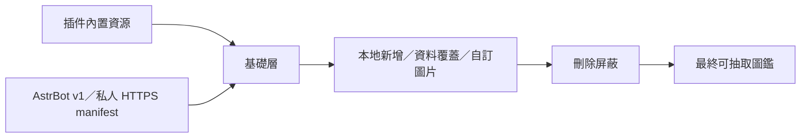

<div align="center">


# 今日小豬 · 增強版

### 每天一隻專屬小豬，把群聊變成一座會成長的收藏館

`astrbot_plugin_rollpig_plus` · AstrBot 每日互動、永久圖鑑與可視化資源管理插件

[](https://github.com/casama233/astrbot_plugin_rollpig/actions/workflows/ci.yml)
[](https://github.com/casama233/astrbot_plugin_rollpig/releases)

[](https://github.com/AstrBotDevs/AstrBot)
[](https://www.python.org/)
[](LICENSE)

[快速開始](#快速開始) · [玩法一覽](#玩法一覽) · [管理面板](#管理面板) · [資源管理](#資源管理) · [文檔中心](#文檔中心)

</div>

> [!NOTE]
> 這不是一個只會回覆隨機圖片的簡單插件。每位使用者都有穩定的每日結果、可持續累積的永久圖鑑、跨日記錄與群聊玩法；管理員則擁有獨立的數據、資源及存儲工作台。

## 3.4.0 版本亮點

| 能力 | 帶來的改進 |
| --- | --- |
| ☁️ AstrBot 專用豬源 | 由本專案維護 v1 manifest、99 張完整資源與 HTTPS 端點，替換失效的 nonebot 來源 |
| 🔐 客戶端協議閘門 | 只接受 AstrBot RollPig 的 Client、Protocol 與版本化 User-Agent，其他普通請求回傳 403 |
| 🧪 可重建、可回退 | 建構器強制校驗圖鑑、圖片、大小與 SHA-256；伺服器保留不可變版本並原子切換 |
| 🧩 本地資源分層 | 一眼分辨「本地新增」與「覆蓋基礎源」，不再猜測哪一筆資料會生效 |
| 🚫 屏蔽管理 | 刪除小豬會進入可查看的屏蔽清單，管理員可安全取消屏蔽 |
| 🖼️ 原圖重修 | 編輯時可下載目前生效的原圖，重修後再上傳替換 |
| 🌐 PigHub 投稿 | 明確確認後，只把名稱與圖片提交到公共人工審核隊列 |
| 📚 文檔重整 | README、配置、運維、資源管理及發版說明按正式專案方式維護 |

完整變更請閱讀 [CHANGELOG](CHANGELOG.md)；使用方式見 [資源管理手冊](docs/RESOURCE-MANAGEMENT.md)，發佈與回退流程見 [豬源維護手冊](docs/RESOURCE-SOURCE-MAINTENANCE.md)。

## 為什麼選擇增強版

<table>
<tr>
<td width="33%" valign="top">

### 🐷 有記憶的每日互動

同一使用者同一天得到固定結果，不會因重複查詢改變；昨日、明日、本週與永久圖鑑共同形成可持續的收集體驗。

</td>
<td width="33%" valign="top">

### 🎮 為群聊設計的玩法

今日烤豬、烤群友、吃群友、隨機互動與豬圈日報，兼顧趣味、冷卻、保護與失敗回退。

</td>
<td width="33%" valign="top">

### 🛡️ 可運維的正式插件

SQLite 事務、JSON 備份、安全更新、資源校驗、身份隔離與管理面板，讓資料可觀察、可恢復、可長期維護。

</td>
</tr>
</table>

## 玩法一覽

- **每日固定抽取**：每日第一次抽取後結果固定，避免反覆刷新刷結果。
- **永久豬圈圖鑑**：記錄解鎖種類、抽取次數、本命豬與 `EX Lv.`。
- **重複保底**：原連續重複保底之外，可配置跨自然日的重複疲勞加成；抽中新豬即重置，總保底率仍封頂 80%。
- **時間視圖**：昨日真實記錄、明日固定預測、七日週報。
- **圖鑑探索**：隨機展示，或按 ID、名稱、描述、完整文案搜尋。
- **群聊互動**：烤自己、烤群友、隨機烤、吃群友與群聊日報。
- **AI 文案**：可選生成烤豬文案；模型不可用時自動回退本地模板。
- **管理工作台**：統計、圖鑑、本地資源、AstrBot／私人豬源、存儲及安全更新集中管理。

## 快速開始

### 環境要求

| 項目 | 要求 |
| --- | --- |
| AstrBot | `>= 4.24.2` |
| Python | `>= 3.10` |
| Python 依賴 | `Pillow >= 10.0.0`、`httpx >= 0.27.0, < 1.0.0` |
| 插件身份 | `astrbot_plugin_rollpig_plus` |

### 安裝

推薦在 AstrBot 插件管理介面搜尋 **「今日小豬 · 增強版」** 或 `astrbot_plugin_rollpig_plus` 安裝。

手動安裝：

```bash
cd /AstrBot/data/plugins
git clone https://github.com/casama233/astrbot_plugin_rollpig astrbot_plugin_rollpig_plus
```

完成後重啟 AstrBot，確認載入的插件身份是 `astrbot_plugin_rollpig_plus`。

> [!IMPORTANT]
> v3.2.0 起增強版使用獨立的程式、配置與資料命名空間。不要把新版直接放進舊 `astrbot_plugin_rollpig` 目錄；由舊版升級時請先閱讀 [身份遷移與恢復](docs/OPERATIONS.md#3-從舊增強版升級到-v320)。

### 第一次使用

先輸入：

```text
/豬豬幫助
```

常用指令：

| 指令 | 用途 |
| --- | --- |
| `/今日小豬` | 抽取或查看自己今天的小豬 |
| `/今日小豬 @某人` | 啟用對應配置後，只讀查看對方今日結果 |
| `/我的豬圈 [頁碼]` | 查看永久圖鑑 |
| `/昨日小豬` / `/明日小豬` | 查看真實昨日記錄或明日固定預測 |
| `/本週小豬` | 生成七日小豬週報 |
| `/隨機小豬 [1-9]` | 隨機展示，不影響每日結果 |
| `/找豬 關鍵詞` | 搜尋 ID、名稱、描述或文案 |
| `/今日烤豬` | 生成趣味料理卡 |
| `/烤群友 @某人` / `/吃群友 @某人` | 群聊互動玩法 |
| `/豬圈日報` | 查看本群今日概況 |

全部指令、別名和玩法限制請看 [指令手冊](docs/COMMANDS.md)。

## 管理面板

在 AstrBot 管理介面的「插件頁面」開啟 **今日小豬**：

| 工作區 | 主要能力 |
| --- | --- |
| 數據總覽 | 總使用者、累計抽取、今日活躍、人均解鎖、收藏率、14 日趨勢與熱門小豬 |
| 豬豬圖鑑 | 搜尋、新增、編輯、刪除、PigHub 選圖、AI 草稿、下載原圖重修 |
| 本地資源 | 查看本地新增與基礎源覆蓋、管理刪除屏蔽、取消屏蔽、提交 PigHub 審核 |
| AstrBot 豬源 | 預設連接本專案 v1 專用源；顯示協議、同步診斷及基礎層狀態，也可改用私人源 |
| 數據存儲 | SQLite 驗證、派生狀態修復、JSON 匯出與安全回退 |
| 插件更新 | 只接受官方穩定 Release，下載、校驗、備份後再替換，不自動重啟 |

所有管理寫操作都經 AstrBot Plugin Page 認證橋接、同源檢查與 CSRF 驗證；深度分析只返回聚合結果，不暴露使用者、群號或聊天原文。

## 資源管理

小豬圖鑑採用明確的分層模型：



優先級由低至高：

1. 插件內置資源；AstrBot 專用源或私人源成功同步後，由遠端資源成為基礎層。
2. 管理面板建立的本地新增、資料覆蓋與自訂圖片。
3. 本地刪除屏蔽。

這代表同步和更新不會悄悄覆蓋管理員的本地編輯；刪除的基礎小豬也不會在下一次同步後自行復活。

### AstrBot 專用源、PigHub 與私人源

- 預設源是 `https://curryudon.top/astrbot-rollpig/v1/manifest.json`，由本專案產生與維護。
- 普通瀏覽器、錯誤客戶端或舊 nonebot 客戶端會收到 HTTP 403；相容的 AstrBot v1 請求可正常同步。
- [PigHub](https://pighub.top/) 是公共圖片分享及人工審核平台，適合投稿單張名稱與圖片。
- PigHub 不是本插件完整的 `pig.json` 元資料源；描述、文案與本地規則不會隨投稿上傳。
- 如需在多個實例間同步完整圖鑑，請維護你有權使用的 HTTPS manifest。
- 舊 `pig.felislab.cc` 仍是 nonebot 專用受限源；v3.4.0 會把該舊地址遷移到新的 AstrBot 專用源。

專用標頭屬於協議相容性檢查，不是不可偽造的秘密；真正封閉的私人源應另外使用每實例 Token 或 mTLS。

manifest 格式、安全限制與故障排查請看 [資源管理手冊](docs/RESOURCE-MANAGEMENT.md)。

## 資料與安全

| 設計 | 行為 |
| --- | --- |
| SQLite 單一運行時權威 | 正常模式下以規範化 SQL 表承擔核心讀寫與唯一性約束 |
| JSON 按需輸出 | 僅在匯出、回退與災難恢復時生成兼容文件 |
| 原子資源替換 | manifest、大小、SHA-256 與圖片尺寸全部通過後才切換基礎層 |
| 協議隔離 | 預設源要求 AstrBot Client／Protocol 標頭與版本化 User-Agent |
| 本地資料隔離 | 插件更新不覆蓋插件資料目錄中的圖鑑、圖片與歷史記錄 |
| 失敗保留現況 | 同步、遷移或更新失敗時保留最後可用版本與恢復證據 |
| 公開投稿需確認 | PigHub 投稿每次都需管理員確認，只傳送名稱與圖片 |

詳細備份、SQLite、身份遷移、更新及恢復流程請看 [運維手冊](docs/OPERATIONS.md)。

## 配置

全部配置定義於 `_conf_schema.json`，推薦透過 AstrBot 插件配置介面修改。

常用配置：

- `at_view_pig`：是否允許 @ 他人只讀查看今日小豬。
- `enable_new_pig_pity` / `pity_step_percent`：連續重複保底。
- `enable_roast` / `enable_group_roast` / `enable_group_eat`：互動玩法開關。
- `enable_ai_roast_copy`：AI 烤豬文案。
- `timezone`：每日邊界時區。
- `resource_sync_enabled` / `resource_manifest_url`：AstrBot 專用源或私人豬源同步。
- `storage_backend` / `storage_busy_timeout_ms`：SQLite 與回退策略。

完整預設值、範圍及建議請看 [配置手冊](docs/CONFIGURATION.md)。

## 升級策略

- **v3.2.0+ → v3.4.0**：直接更新；現有 SQLite、本地小豬、自訂圖片和屏蔽記錄會保留。
- **v3.1.4 或更早增強版 → v3.4.0**：先完成獨立身份遷移，再確認新資料正常。
- **原版與增強版同時存在**：系統只提示衝突，不會擅自停用或刪除另一個插件。
- **舊 nonebot 源配置**：精確匹配失效舊地址時會遷移到 AstrBot v1 專用源；其他自訂私人 URL 保持不變。

## 文檔中心

| 文檔 | 適合誰 | 內容 |
| --- | --- | --- |
| [指令手冊](docs/COMMANDS.md) | 使用者、群管理員 | 指令、別名、限制與玩法規則 |
| [配置手冊](docs/CONFIGURATION.md) | 插件管理員 | 全配置項、預設值與建議 |
| [資源管理手冊](docs/RESOURCE-MANAGEMENT.md) | 資源維護者 | 分層、manifest、PigHub 投稿與 403 排查 |
| [豬源維護手冊](docs/RESOURCE-SOURCE-MAINTENANCE.md) | 來源維護者 | 建構、協議閘門、部署、驗證與原子回退 |
| [運維手冊](docs/OPERATIONS.md) | 系統管理員 | 遷移、SQLite、備份、恢復與安全更新 |
| [市場分發](docs/MARKETPLACE.md) | 發版維護者 | 16 MB 限制、精簡包及驗證規則 |
| [貢獻指南](CONTRIBUTING.md) | 開發者 | 開發環境、測試與提交規範 |
| [版本記錄](CHANGELOG.md) | 所有人 | 每個正式版本的可見變更 |

## 開發與驗證

```bash
python -m pip install -r requirements.txt pytest pre-commit
python -m compileall -q main.py rollpig_core.py updater.py storage services
pytest -q
pre-commit run --all-files --show-diff-on-failure
npm ci
npm test
```

Release 由 `metadata.yaml` 的穩定版本號觸發，CI 生成 `astrbot_plugin_rollpig_plus-vX.Y.Z.zip` 與 `SHA256SUMS`，並檢查 AstrBot 市場 16 MB 上限。

## 致謝

- 原始核心：[Bearlele/nonebot-plugin-rollpig](https://github.com/Bearlele/nonebot-plugin-rollpig)
- AstrBot 上游：[MegSopern/astrbot_plugin_rollpig](https://github.com/MegSopern/astrbot_plugin_rollpig)
- 公共圖片平台：[PigHub](https://pighub.top/) 與 [PigHub-DB](https://github.com/BadFish-HSrui/PigHub-DB)

本增強分支持續保留原作者署名與 MIT 授權資訊。

## License

本專案採用 [MIT License](LICENSE)。
